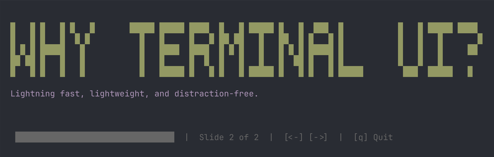

# SLITTY - Present your slides in the terminal



You can run Slitty in any standard terminal (like iTerm2), but it looks especially good in Ghostty since you can easily hide the window borders.

Here is a quick command to launch Ghostty as a clean, borderless presentation window:

```bash
/Applications/Ghostty.app/Contents/MacOS/ghostty --window-decoration=false --window-width=182 --window-height=25 --font-size=24 --background-opacity=1.0  -e bash -c "cd ~/Dev/terminal-keynote && uv run keynote.py slides.json"
```

## Creating Your Slides

Slitty reads your presentation from a standard JSON file. The file should contain an array of slide objects. 

Here are the keys you can use for each slide:

* `title`: Standard text title.
* `banner`: Huge 5x5 block-letter text (looks great, but keep it short so it fits the screen). Use this *instead* of `title`.
* `subtitle`: Regular text that appears below the title/banner.
* `typewriter`: Set to `true` to animate the subtitle typing out character by character.
* **Colors**: Use `title_color`, `banner_color`, and `subtitle_color` to style your text. Available colors: `white`, `cyan`, `yellow`, `green`, `magenta`, `red`, `blue`, `black`.

### Example `slides.json`

```json
[
  {
    "banner": "SLITTY",
    "banner_color": "cyan",
    "subtitle": "Presentations in the terminal",
    "subtitle_color": "yellow",
    "typewriter": true
  },
  {
    "title": "Standard Slide",
    "title_color": "green",
    "subtitle": "You can mix normal titles and big banners in the same deck.",
    "subtitle_color": "white"
  }
]
